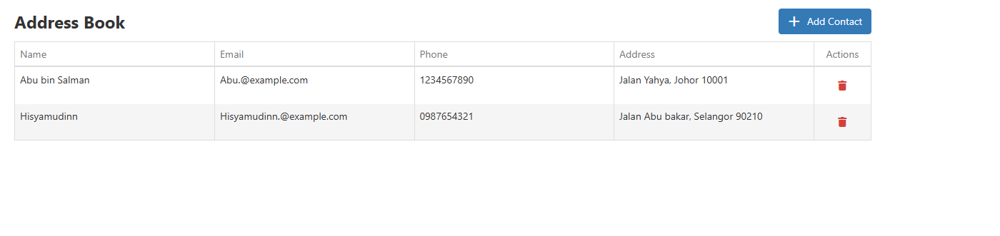
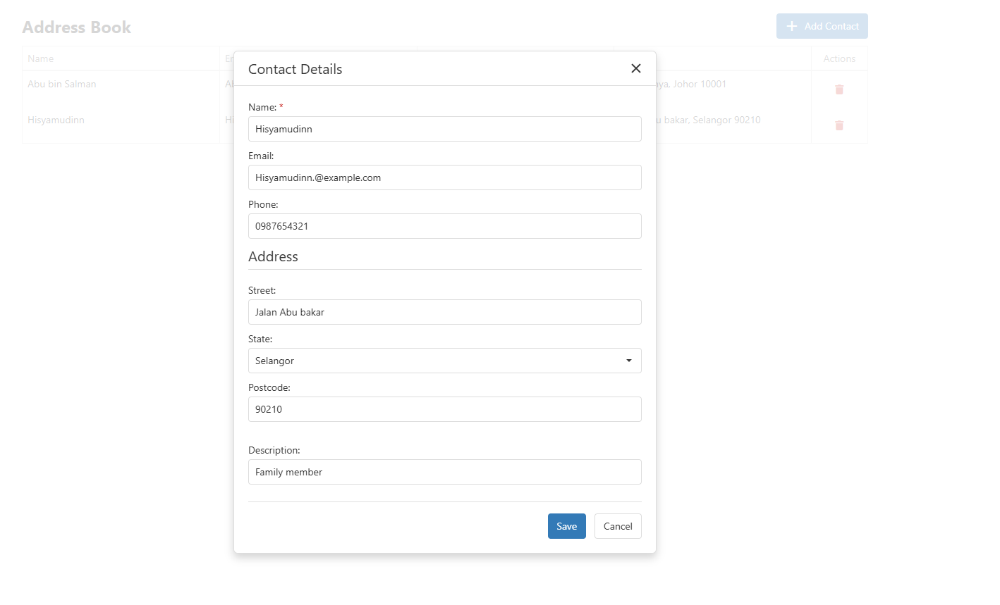

## Application Preview

Below is a detailed walkthrough of the application's user interface, core components, and functional workflows, captured from the live Angular application:

### 1. DataGrid & Address Book List View (Parent Component)
This section demonstrates the main dashboard interface driven by the **DevExtreme DataGrid (`dx-data-grid`)**. 

* **Dynamic Data Binding:** The data grid is bound directly to an Angular Service data source, rendering real-time rows containing contact info such as Name, Email, and Phone.
* **Custom Column Expression:** The "Address" column dynamically concatenates multiple data properties (Street + State + Postcode) into a single readable string format.
* **Custom Toolbar Integration:** Built using the Native DevExtreme toolbar template, featuring a clean application title on the left and a stylized **"+ Add Contact"** action button on the right.
* **Row Manipulation:** Includes a dedicated "Actions" column utilizing a styled red trash bin icon to trigger the native JavaScript confirmation alert before safely removing the item from the in-memory array.

---

### 2. Form Validation & Popup Modal (Child Component via dx-popup)
This section showcases the data entry and management layer, utilizing a fully modalized **DevExtreme Popup (`dx-popup`)** container.

* **Parent-Child Component Communication:** When a row is clicked in the main grid, the parent component captures the row data and passes it into the encapsulated child modal component via `@Input()` bindings.
* **Strict Client-Side Validation:** - **Name:** Marketed with a red asterisk (`*`), strictly enforced as a required field.
  - **Email:** Validated against structured regex patterns to prevent illegal email formatting.
  - **Phone & Postcode:** Controlled to accept numeric characters only, automatically blocking letters or special characters.
* **Dynamic Mode & Button Toggling:** The child component safely evaluates whether the user is inserting a new contact or modifying an existing one. Control actions change dynamically to provide **Save** or **Create** options, which remain conditionally disabled until all DevExtreme validation constraints pass successfully. A **Cancel** button is positioned adjacent to dismiss the modal without mutating the state.

